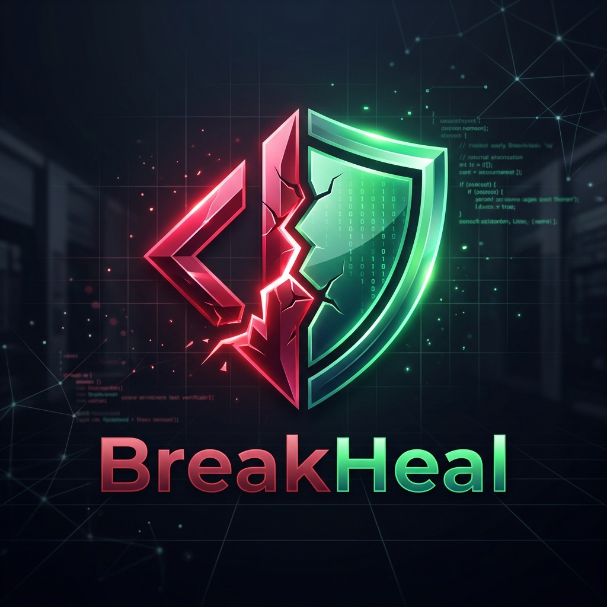
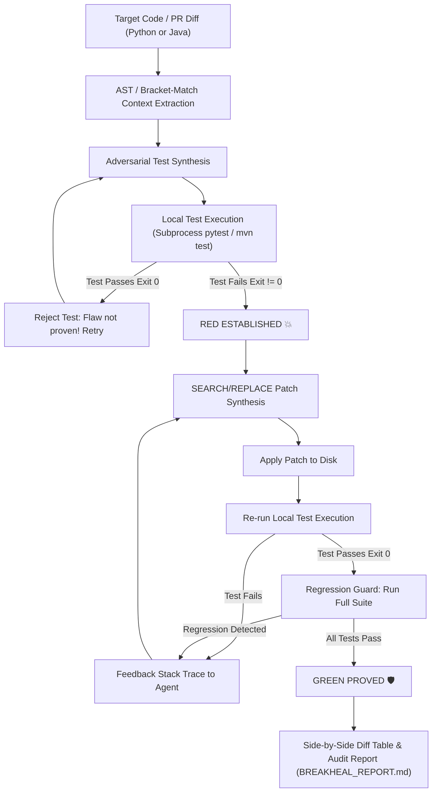

<p align="center">
  
</p>

# BreakHeal 🛡️💥🩹

> **Autonomous Red-to-Green Automated Software Engineering (Python, Java, TypeScript, Go, Rust)**  
> *Adversarial PR edge-case breaker and compiler-backed test prover.*

[](https://www.python.org/downloads/)
[](https://www.typescriptlang.org/)
[](https://openjdk.org/)
[](https://go.dev/)
[](https://www.rust-lang.org/)
[](https://groq.com/)
[]()
[]()


---

## 🎯 The Problem with Modern AI Code Review

Current AI code review tools (CodeRabbit, PR-Agent, Copilot) suffer from two fatal flaws:
1. **Speculative Comments:** They post verbose inline comments guessing potential bugs without verifying whether they are reproducible. Engineers quickly suffer from notification fatigue and ignore them.
2. **Hallucinated Patches:** When generating fixes, generative LLMs output malformed diffs or syntactically invalid code that fails compilation or breaks other parts of the application.

---

## ⚡ The BreakHeal Solution: Deterministic Red-to-Green

BreakHeal takes inspiration from Test-Driven Development (TDD) and formal verification:

1. **💥 PROVE RED:** BreakHeal's adversarial agent synthesizes an isolated unit test exposing a boundary bug (zero-division, off-by-one, null dereference). It runs the test via local subprocess (`pytest` or `mvn test`). **If the test does not fail against unmodified code, it is rejected.**
2. **🩹 SYNTHESIZE PATCH:** BreakHeal generates a minimal, unambiguous `SEARCH/REPLACE` block directly targeting the flaw.
3. **🛡️ PROVE GREEN:** BreakHeal applies the patch and runs the adversarial test again. **If it doesn't pass with Exit Code 0, the patch is fed back for iterative multi-turn repair.**
4. **🔒 REGRESSION GUARD:** Before accepting any fix, BreakHeal runs the full existing test suite to ensure zero regressions are introduced.



---

## 🏆 Competitive Comparison Matrix

| Feature | BreakHeal | CodeRabbit | GitHub Copilot | PR-Agent |
| :--- | :---: | :---: | :---: | :---: |
| **Deterministic Local Proof** | **Yes (Exit 0 Verified)** | No (Text review only) | No (Text generation) | No (Text review only) |
| **Synthesizes Breaking Unit Tests** | **Yes (Pytest & JUnit 5)** | No | No | No |
| **Zero Unified-Diff Failures** | **Yes (`SEARCH/REPLACE`)** | N/A | High failure rate | High failure rate |
| **Multi-Language Polyglot** | **Yes (Python, Java, TS, Go, Rust)** | Any (text only) | Any (text only) | Any (text only) |
| **Interactive Web Dashboard** | **Yes (`breakheal report --serve`)** | No | No | No |
| **Empirical Polyglot Benchmark** | **Yes (`breakheal benchmark`)** | No | No | No |
| **Cross-Module Contract Resolver** | **Yes (Local AST crawl)** | No | Limited | Limited |
| **Regression Guard** | **Yes (Subprocess suite run)** | No | No | No |
| **Interactive Terminal TUI** | **Yes (Rich Pipeline Cards)** | No | No | No |
| **Interactive Demo Mode** | **Yes (`breakheal demo`)** | No | No | No |
| **Automated PR Branch Commit** | **Yes (`--auto-commit`)** | No | No | Optional |

---

## 🚀 Installation & Quickstart

### Prerequisites
- Python 3.11+
- Java JDK 17+ and Apache Maven (for Java projects)
- Groq API Key (Free tier at [console.groq.com](https://console.groq.com/))

### Setup
```bash
git clone https://github.com/Basit-94/BreakHeal.git
cd BreakHeal

# Create virtual environment
python -m venv .venv
source .venv/bin/activate  # Windows: .venv\Scripts\activate

# Install in editable mode
pip install -e .

# Set up your Groq API Key
echo GROQ_API_KEY=gsk_your_key_here > .env
```

---

## 💻 CLI Commands & Usage

### 1. Interactive Demo Mode
Run an automated demonstration of BreakHeal's end-to-end self-healing pipeline:
```bash
# Showcase both Python and Java end-to-end self-healing
breakheal demo

# Python-only demo
breakheal demo --lang python

# Java enterprise JUnit 5 + Maven demo
breakheal demo --lang java

# Fast playback
breakheal demo --speed fast
```

### 2. Heal a Specific File or Function (`run`)
Target any Python or Java file directly:
```bash
# Audit and heal a Python file
breakheal run --file demo_repo/pricing.py --yes

# Audit and heal a Java file with JUnit 5 and Maven Surefire
breakheal run --file demo_java/src/main/java/com/breakheal/demo/DiscountCalculator.java --yes

# Auto-detect modified code from uncommitted git changes
breakheal run
```

### 3. Multi-Language Directory Scan (`scan`)
Recursively discover every function and method in a repository and heal all boundary vulnerabilities:
```bash
# Scan entire repository for Python functions and Java methods
breakheal scan . --yes
```

### 4. Automated Pull Request Gatekeeper (`pr`)
Analyze branch diffs against `main`, synthesize tests for all modified code, and optionally auto-commit verified fixes:
```bash
breakheal pr --base main --auto-commit --yes
```

### 5. Drop-in GitHub Actions Workflow (`init-ci`)
Generate `.github/workflows/breakheal.yml` for automated CI/CD protection:
```bash
breakheal init-ci
```

### 6. Interactive Visual Web Dashboard (`report`)
Generate or host an interactive, offline-ready web dashboard with execution timelines, stats cards, and side-by-side diffs:
```bash
# Generate standalone HTML report
breakheal report --html BREAKHEAL_REPORT.html

# Launch local server and open dashboard in default browser
breakheal report --serve --port 8080
```

### 7. Empirical Polyglot Benchmark Suite (`benchmark`)
Evaluate autonomous repair against 25 standardized real-world boundary vulnerabilities across Python, Java, TypeScript, Go, and Rust:
```bash
# Run complete 25-case polyglot benchmark
breakheal benchmark

# Run benchmark for specific language
breakheal benchmark --lang python
```

---

## 🧪 Verification & Testing

BreakHeal is thoroughly covered with automated unit and regression tests:
```bash
# Run all Python unit tests
python -m pytest

# Run Java Maven integration tests
cd demo_java && mvn test
```

---

## 📄 License
MIT License. Built with ❤️ for autonomous software engineering.
